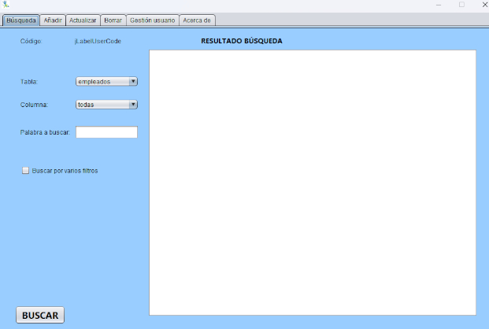
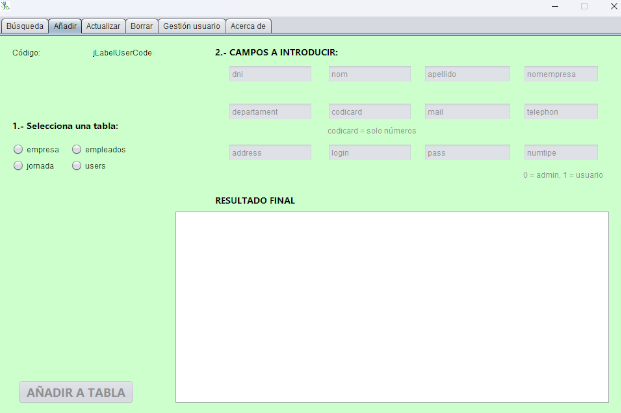
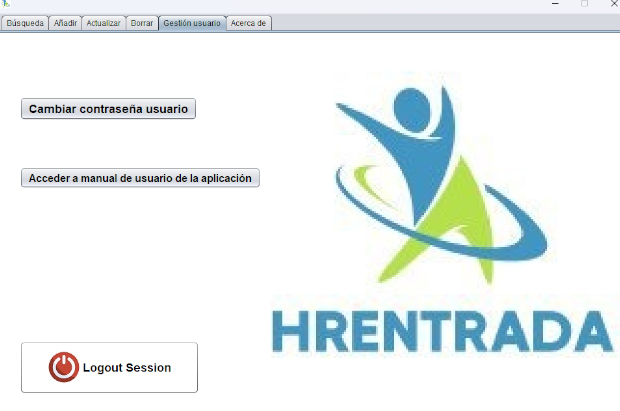
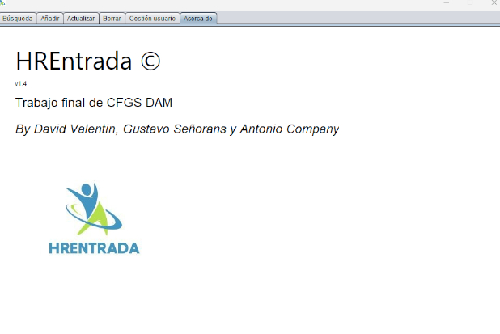

Proyecto final de CFGS DAM

Aplicación de escritorio desarrollada como parte del proyecto final del Grado Superior de Desarrollo de Aplicaciones Multiplataforma. Esta herramienta permite gestionar el control de horas laborales de los trabajadores en una empresa.

## 🧩 Estructura del Proyecto

Este sistema completo se compone de tres partes:
- 🖥️ **Aplicación de Escritorio (este repositorio)**: interfaz para el personal administrativo para visualizar, consultar y exportar registros de horas.
- 🌐 **Servidor central** recibe, almacena y proporciona los datos vía conexión remota. [Enlace al servidor del proyecto](https://github.com/Trope16121980/ServerHREntrada)
- 📱 **Aplicación Android** permite al trabajador usar la app desde el móvil. [Enlace a la parte mobil del proyecto]( https://github.com/davidval2022/HREntradaClienteApp-)

> ⚠️ Este repositorio contiene exclusivamente la aplicación de escritorio.

---

## 💡 Funcionalidades destacadas

- Registro de entrada y salida de empleados
- Visualización de horas totales trabajadas por empleado
- Búsqueda y filtrado por fechas, empleado y tipo de jornada
- Exportación de informes a PDF y/o Excel
- Autenticación para personal autorizado
- Conexión a servidor externo vía red local o internet

---

## ⚙️ Tecnologías usadas

- Lenguaje: C#
- Framework: .NET Framework / WinForms
- Base de datos: MySQL (conector remoto)
- IDE: Visual Studio 2022

---

## 🖼️ Capturas de pantalla

-VENTANA DE LOGIN

 
-INTERFAZ PRINCIPAL CON SUS PESTAÑAS

-GESTIÓN DE USUARIO

-PESTAÑA ACERCA DE

